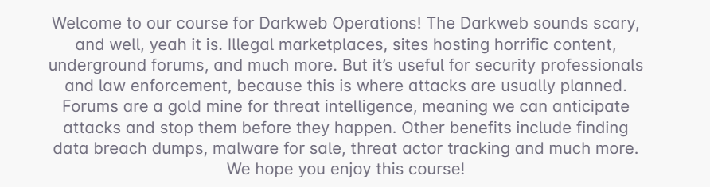
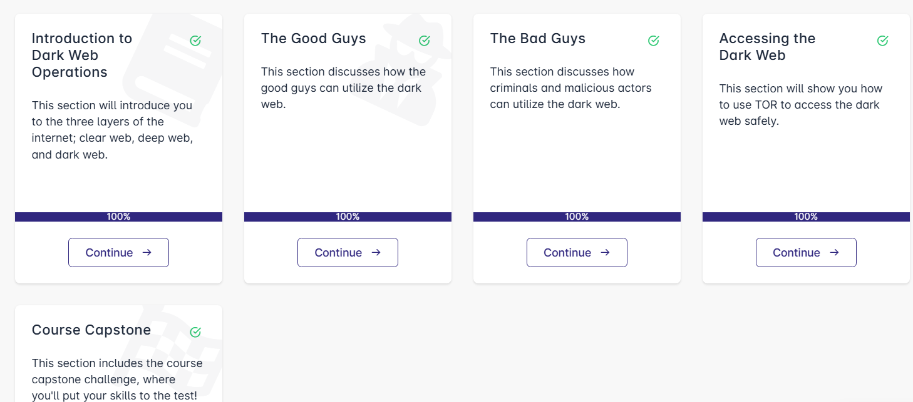

# 🕵️ Introduction to Dark Web Operations – Security Blue Team

This repository contains **notes, labs, guides, case studies, extras, misc, and a certificate of completion** for the  
*Introduction to Dark Web Operations* program by **Security Blue Team**.  

The course focuses on **Tor/I2P, darknet ecosystems, Blue Team monitoring, OSINT, forensic handling, and law enforcement collaboration**.

---

## 📚 Notes
- 📄 [01-intro-darkweb-ethics-legal.md](./notes/01-intro-darkweb-ethics-legal.md) – Ethics & legal frameworks  
- 📄 [02-tor-i2p-overview.md](./notes/02-tor-i2p-overview.md) – Tor & I2P overview  
- 📄 [03-darknet-ecosystem.md](./notes/03-darknet-ecosystem.md) – Darknet ecosystems & comms  
- 📄 [04-opsec-lab-setup.md](./notes/04-opsec-lab-setup.md) – OpSec & lab setup  
- 📄 [05-osint-crawling.md](./notes/05-osint-crawling.md) – OSINT & crawling darknet content safely  
- 📄 [06-monitoring-indicators.md](./notes/06-monitoring-indicators.md) – Monitoring & indicators  
- 📄 [07-forensics-preservation.md](./notes/07-forensics-preservation.md) – Forensics & evidence preservation  
- 📄 [08-incident-response-liaison.md](./notes/08-incident-response-liaison.md) – Incident response & LE liaison  

---

## 🧪 Labs
- 🔧 [01-setup-virtual-lab.md](./labs/01-setup-virtual-lab.md) – Virtual lab setup  
- 🔧 [02-tor-client-observation.md](./labs/02-tor-client-observation.md) – Observing Tor traffic  
- 🔧 [03-ecosystem-mapping.md](./labs/03-ecosystem-mapping.md) – Mapping darknet ecosystem  
- 🔧 [04-opsec-sandboxing.md](./labs/04-opsec-sandboxing.md) – Practicing OpSec  
- 🔧 [05-osint-crawler-simulation.md](./labs/05-osint-crawler-simulation.md) – Metadata crawler simulation  
- 🔧 [06-siem-indicators.md](./labs/06-siem-indicators.md) – SIEM integration with IoCs  
- 🔧 [07-forensic-artifacts.md](./labs/07-forensic-artifacts.md) – Collecting forensic artifacts  
- 🔧 [08-incident-reporting.md](./labs/08-incident-reporting.md) – Drafting incident reports  

---

## 📝 Extras
- 📑 [case-studies.md](./extras/case-studies.md) – Darknet takedowns & Blue Team lessons  
- 📑 [resources.md](./extras/resources.md) – Tools, reports, research & legal frameworks  

---

## 🗂️ Misc
- 📑 [faq.md](./misc/faq.md) – Frequently Asked Questions  
- 📑 [checklist.md](./misc/checklist.md) – Analyst checklist  
- 📑 [timeline.md](./misc/timeline.md) – Timeline of darknet events  

---

## 📖 Docs
- 📘 [index.md](./docs/index.md) – Course overview  
- 📘 [syllabus.md](./docs/syllabus.md) – 8-week syllabus  
- 📘 [roadmap.md](./docs/roadmap.md) – Post-course roadmap  
- 📘 [references.md](./docs/references.md) – References & citations  
- 📘 [glossary.md](./docs/glossary.md) – Key terms & definitions  

---

## 📸 Screenshots

| Step | Screenshot |
|------|------------|
| 📚 Course Content |  |
| 🏫 Course Details |  |

---

## 📜 Certificate
🎓 [Introduction to Dark Web Operations — Security Blue Team](./cert/Introduction%20to%20Dark%20Web%20Operations-course.pdf)

---

## ✍️ Personal Review
This program provides a **defensive-oriented introduction to darknet operations**.  
Key strengths include:
- Structured approach to **ethics, OpSec, and legal compliance**.  
- Practical **labs** in safe environments.  
- Coverage of **OSINT, forensic workflows, and SIEM integration**.  

Ideal for **Blue Team analysts, SOC engineers, and threat intel researchers** seeking darknet awareness without crossing legal/ethical lines.

---

## ✍️ Author
**Thành Danh** – Red Team Learner & Security Researcher  

- GitHub: [@ngvuthdanhh](https://github.com/ngvuthdanhh)  
- Email: ngvu.thdanh@gmail.com  

---

## 📄 License
This project is licensed under the terms of the **MIT License**. See [LICENSE](./LICENSE) for details.  
© 2025 ngvuthdanhh. All rights reserved.  
